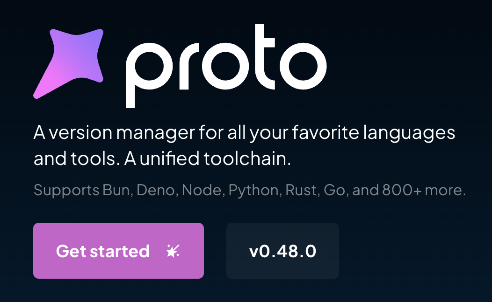

Since most MCPs run locally and are built with TypeScript, Python, or Docker, you'll need to set up your development environment properly. This guide will help you install all the necessary tools.

<Info>
  Setting up your environment correctly is crucial for a smooth development experience with MCPs. Following these recommendations will help you avoid common setup issues.
</Info>

## Proto - Version Manager

<Frame>
  
</Frame>

We recommend using [Proto](https://moonrepo.dev/proto) for installing and managing versions of Node.js, Python, and their package managers. Proto is written in Rust, making it very fast and efficient.

<Tip>
  Proto provides a unified interface for managing multiple languages and tools, which simplifies your development workflow considerably.
</Tip>

### Installing Proto

#### For Linux, macOS, or WSL:

```bash
bash <(curl -fsSL https://moonrepo.dev/install/proto.sh)
```

#### For Windows:

```powershell
irm https://moonrepo.dev/install/proto.ps1 | iex
```

<Check>
  After installation, verify Proto is working by running `proto --version` in your terminal.
</Check>

## Programming Languages

### Node.js

Install the latest version of Node.js:

```bash
proto install node latest
```

<Note>
  For specific MCP requirements, you might need to install a particular version of Node.js. Always check the MCP's documentation for compatibility.
</Note>

### Python

Install Python:

```bash
proto install python
```

## Package Managers

### For TypeScript: Bun

Bun is faster than npm for TypeScript projects:

```bash
proto install bun
```

<Info>
  Bun not only serves as a package manager but also as a JavaScript runtime, bundler, and test runner, making it a comprehensive tool for TypeScript development.
</Info>

### For Python: uv

uv is faster than pip/poetry for Python projects:

```bash
proto install uv
```

<Tip>
  When using uv, you can create and activate virtual environments with `uv venv` and `uv venv activate`, keeping your Python dependencies isolated.
</Tip>

## Docker

<Warning>
  Docker requires administrative privileges to install. Make sure you have the necessary permissions on your system.
</Warning>

### For macOS

We recommend [OrbStack](https://orbstack.dev/) for macOS users as it's very lightweight and optimized.

<Check>
  OrbStack provides better performance and consumes fewer resources compared to Docker Desktop on macOS.
</Check>

### For Other Operating Systems

For Windows, Linux, and other operating systems, use the official [Docker](https://www.docker.com/) installation.

<Note>
  Remember to start the Docker service after installation and verify it's running with `docker --version`.
</Note>

## Next Steps

<Info>
  Once you have your environment set up, you're ready to start developing with MCPs. Check out our other guides to learn how to create and deploy your first MCP.
</Info>

