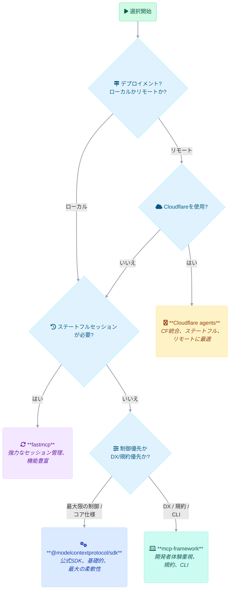

# <Icon icon="chart-bar" iconType="solid" color="#3B82F6" /> MCPサーバーフレームワーク比較

<Callout type="info">
  <Icon icon="info-circle" iconType="solid" /> Model Context Protocol（MCP）は、アプリケーションが大規模言語モデル（LLM）にコンテキストを提供する方法を標準化するオープンスタンダードです。クライアント・サーバーアーキテクチャに基づいており、AIモデルが特定のデータや機能に安全にアクセスできるようにします。MCPを使うことで、ホスト（IDEやAIツールなど）はクライアントを介してサーバー（機能を提供する軽量プログラム）と通信し、ローカルまたはリモートのデータソースに安全にアクセスできます。
</Callout>

## <Icon icon="bolt" iconType="solid" /> クイック選択ガイド

このガイドは、主な特長に基づいてフレームワークを素早く選択するのに役立ちます：

<Cards>
  <Card title="@modelcontextprotocol/sdk" href="#overview-philosophy">
    <Icon icon="code" iconType="solid" /> **選ぶポイント:** 公式の仕様準拠の実装で最大限の制御が必要な場合。基礎的な作業や厳格な準拠が最も重要な場合に最適です。
  </Card>
  <Card title="Cloudflare agents" href="#overview-philosophy">
    <Icon icon="cloud" iconType="solid" /> **選ぶポイント:** 特にCloudflareのエッジネットワーク上でステートフルなAIエージェントをデプロイする場合。Cloudflareとの統合と管理されたインフラを活用できます。
  </Card>
  <Card title="fastmcp" href="#overview-philosophy">
    <Icon icon="tachometer-alt" iconType="solid" /> **選ぶポイント:** セッション管理、ストリーミング、本番環境向け機能（認証、ロギングなど）が重要な場合。すぐに使える豊富な機能セットを提供します。
  </Card>
  <Card title="mcp-framework" href="#overview-philosophy">
    <Icon icon="laptop-code" iconType="solid" /> **選ぶポイント:** 規約よりも設定、迅速な開発、CLIツールを重視する場合。公式SDKの上に構築され、開発者体験を重視しています。
  </Card>
</Cards>

## <Icon icon="list" iconType="solid" /> 機能比較

さまざまな機能で各フレームワークを比較してみましょう。

<Tabs items={['概要グリッド', '詳細機能表']}>
  <Tab title="概要">
    | 機能                         | `@modelcontextprotocol/sdk` | `Cloudflare agents`       | `fastmcp`                  | `mcp-framework`            |
    | :--------------------------- | :-------------------------- | :------------------------ | :------------------------- | :------------------------- |
    | **主な目的**                  | コアMCP実装                  | ステートフルなエッジAIエージェント | セッション機能付きMCPサーバー   | 開発者体験重視のMCPフレームワーク |
    | **MCP準拠**                  | 公式標準                     | 高（エージェント重視）        | 高                         | 高（公式SDK使用）           |
    | **アーキテクチャ**            | 低レベルプリミティブ           | アクターモデル（Workers）    | セッション中心                | 規約よりも設定               |
    | **トランスポート**             | `stdio`, `HTTP (SSE)`      | `HTTP (SSE)`, `WebSockets` | `SSE`, `stdio`            | `stdio`, `SSE`, `HTTP Stream` |
    | **状態管理**                  | 手動                        | 組み込み（Durable Objects） | セッションベース              | 手動/リクエストごと          |
    | **認証**                     | 手動                        | Cloudflare Access/OAuth経由 | 組み込み                    | 組み込み（SSE）             |
    | **開発者体験（DX）**           | 基本的                      | 高（Cloudflare統合）        | 高（特定機能）               | 高（CLI、規約）             |
    | **CLIツール**                | なし                         | `wrangler`               | テストユーティリティ           | あり（`mcp`）               |
    | **デプロイメント**             | ローカル/任意サーバー          | Cloudflare Workers        | ローカル/任意サーバー          | ローカル/任意サーバー         |
  </Tab>
  <Tab title="詳細比較">
    | 機能 | @modelcontextprotocol/sdk | Cloudflare agents | fastmcp | mcp-framework | 備考 |
    |------|---------------------------|-------------------|---------|---------------|------|
    | **プロトコル準拠** | | | | | |
    | MCP仕様準拠 | ◯ | ◯ | ◯ | ◯ | すべての実装がMCP仕様に従っています |
    | ツールサポート | ◯ | ◯ | ◯ | ◯ | |
    | リソースサポート | ◯ | △ | ◯ | ◯ | Cloudflare: 限定的なサポート、近日公開予定 |
    | プロンプトサポート | ◯ | △ | ◯ | ◯ | Cloudflare: 開発中 |
    | サンプリングサポート | ◯ | △ | ◯ | △ | `fastmcp`: 明示的なサンプリングサポート |
    | **トランスポートオプション** | | | | | |
    | `stdio` | ◯ | ✗ | ◯ | ◯ | Cloudflare: リモート使用のみを想定 |
    | `HTTP/SSE` | ◯ | ◯ | ◯ | ◯ | 標準リモートトランスポート |
    | ストリーム可能HTTP | △ | ◯ | △ | △ | 進化するトランスポート方式、`mcp-framework`は実験的サポートあり |
    | WebSocketサポート | ✗ | △ | ✗ | ✗ | Cloudflare: 将来的に計画あり |
    | **デプロイメント** | | | | | |
    | ローカルデプロイメント | ◯ | ✗ | ◯ | ◯ | `agents`はローカル用のリモートアダプタが必要 |
    | リモートデプロイメント | ◯ | ◯ | ◯ | ◯ | |
    | クラウド統合 | △ | ◯ | △ | ✗ | Cloudflare: ネイティブWorkers統合 |
    | **認証とセキュリティ** | | | | | |
    | 基本認証 | 手動 | Cloudflare Access経由 | ◯ | △ (SSEのみ) | `fastmcp`: 組み込みサポート |
    | OAuthサポート | 手動 | ◯ | 手動 | ✗ | Cloudflare: 組み込みOAuthプロバイダー |
    | セッション管理 | 手動 | ◯ (Durable Objects) | ◯ | 手動 | `fastmcp`: コア機能 |
    | **開発者体験** | | | | | |
    | ドキュメント品質 | ◯ | ◯ | ◯ | △ | `mcp-framework`: 改善中 |
    | サンプルとテンプレート | ◯ | ◯ | ◯ | △ | `mcp-framework`: CLIに依存 |
    | TypeScriptサポート | ◯ | ◯ | ◯ | ◯ | すべてがTS優先 |
    | 型安全性 | ◯ | ◯ | ◯ | ◯ | Zod/TSによる強力な型付け |
    | CLIテストツール | ✗ | ◯ (`wrangler`) | ◯ | ◯ (`mcp`) | `mcp-framework` CLIはスキャフォールディング/実行用 |
    | ホットリロード | ✗ | ◯ (`wrangler dev`) | △ | △ (`mcp dev`) | フレームワーク依存 |
    | **機能** | | | | | |
    | 進捗通知 | ◯ | △ | ◯ | △ | |
    | エラー処理 | 基本 | フレームワークレベル | ◯ | フレームワークレベル | `fastmcp`: 包括的な処理 |
    | ロギング | 基本 | 統合（CF） | ◯ | 基本 | `fastmcp`: 組み込みロギング |
    | CORSサポート | 手動 | ◯ | ◯ | △ (SSEのみ) | Webクライアントに必要 |
    | 画像コンテンツサポート | ◯ | ◯ | ◯ | △ | MCPの標準 |
    | 自動SSEピング | 手動 | ◯ | ◯ | ✗ | SSEのキープアライブ |
    | キャンセルサポート | ◯ | ◯ | ◯ | △ | MCPの標準 |
    | **エコシステム** | | | | | |
    | コミュニティサポート | ◯ (公式) | ◯ (Cloudflare) | ◯ (活発) | △ (成長中) | |
    | アクティブな開発 | ◯ | ◯ | ◯ | ◯ | すべて積極的にメンテナンスされている |
    | 本番環境対応 | ◯ | ◯ | ◯ | ◯ | すべて本番環境で使用されている |
    | 外部サービス統合 | 手動 | ◯ (Workers) | 手動 | 手動 | Cloudflareが優れている |

    **凡例:**
    - ◯ **完全サポート / 組み込み:** 機能が十分に実装され、文書化されています。
    - △ **部分的 / 手動 / 基本:** 機能は存在するが手動設定が必要、基本的、または開発中です。
    - ✗ **サポートなし:** 機能はサポートされていないか、適用されません。
  </Tab>
</Tabs>

## <Icon icon="server" iconType="solid" /> デプロイメントモデル: ローカル vs リモート

MCPサーバーをローカルまたはリモートで実行する際のトレードオフを理解しましょう。

<Tabs items={['ローカルMCPサーバー', 'リモートMCPサーバー']}>
  <Tab title="ローカルMCPサーバー">
    ### <Icon icon="desktop" iconType="solid" /> ローカルMCPサーバー

    ユーザーのマシン上で直接実行され、通常は`stdio`を介して通信します。

    <Callout type="success">
      <Icon icon="check-circle" iconType="solid" /> **利点**
      - **直接データアクセス:** ローカルファイル、データベース、システムリソースに簡単にアクセスできます。
      - **低レイテンシ:** 通信にネットワークオーバーヘッドがありません。
      - **プライバシー強化:** 機密データがユーザーのデバイスに残ります。
      - **簡素化されたセキュリティ:** 複雑なリモート認証の必要性を回避できることが多いです。
      - **オフライン機能:** インターネット接続なしで機能します。
    </Callout>

    <Callout type="warning">
      <Icon icon="exclamation-triangle" iconType="solid" /> **欠点**
      - **限られた範囲:** インストールされたマシンでのみアクセス可能です。
      - **インストールの負担:** 各ユーザーのデバイスでのセットアップが必要です。
      - **配布の課題:** Webサービスと比較して配布と更新が難しいです。
      - **スケーラビリティの制限:** ローカルマシンのリソースに制約されます。
    </Callout>

    **主な通信方法**: <Icon icon="terminal" iconType="solid" /> `stdio` (標準入出力)
    **最適なフレームワーク**: `@modelcontextprotocol/sdk`, `fastmcp`, `mcp-framework`
  </Tab>
  <Tab title="リモートMCPサーバー">
    ### <Icon icon="globe" iconType="solid" /> リモートMCPサーバー

    サーバーまたはクラウドプラットフォーム上でホストされ、ネットワーク経由でアクセス可能で、通常は`HTTP/SSE`を使用します。

    <Callout type="success">
      <Icon icon="check-circle" iconType="solid" /> **利点**
      - **アクセシビリティ:** インターネットアクセスがあるどのデバイスからもアクセス可能です。
      - **集中管理:** デプロイメント、更新、メンテナンスが容易です。
      - **広範な到達:** 複数のユーザーに同時にサービスを提供できます。
      - **スケーラビリティ:** スケーリングのためにクラウドインフラストラクチャを活用できます。
      - **共有リソース:** 共有データベースや外部APIに一元的に接続できます。
    </Callout>

    <Callout type="warning">
      <Icon icon="exclamation-triangle" iconType="solid" /> **欠点**
      - **接続依存:** 安定したインターネット接続が必要です。
      - **複雑な認証:** リモートアクセス用の堅牢なセキュリティ対策が必要です。
      - **プライバシーの考慮:** ネットワーク経由のデータ転送は慎重な取り扱いが必要です。
      - **ネットワークレイテンシ:** 通信速度はネットワーク状況の影響を受けます。
      - **インフラコスト:** ホスティングとメンテナンスの費用。
    </Callout>

    **主な通信方法**:
    - <Icon icon="exchange-alt" iconType="solid" /> HTTPとServer-Sent Events (SSE)
    - <Icon icon="stream" iconType="solid" /> ストリーム可能HTTP (進化する標準)
    - <Icon icon="plug" iconType="solid" /> WebSockets (計画中/一部でサポート)
    **最適なフレームワーク**: `Cloudflare agents`, `@modelcontextprotocol/sdk`, `fastmcp`, `mcp-framework`
  </Tab>
</Tabs>

## <Icon icon="boxes" iconType="solid" /> フレームワーク詳細

各フレームワークの基本理念、機能、典型的なユースケース、コード例を探ります。

### <Icon icon="puzzle-piece" iconType="solid" /> 概要と哲学

各フレームワークの背後にある主な目的と設計原則を理解します。

<Tabs items={['@modelcontextprotocol/sdk', 'Cloudflare agents', 'fastmcp', 'mcp-framework']}>
  <Tab title="@modelcontextprotocol/sdk">
    
    - **目的:** MCP仕様の公式TypeScript実装を提供すること。
    - **哲学:** 最大限の制御と厳格な仕様準拠のための低レベルプリミティブ（`Server`, `Resource`, `Tool`, `Prompt`）を提供。MCPコア以上の構造を強制しません。
    - **性質:** フルフレームワークではなく、ライブラリ/SDK。`mcp-framework`のような他のフレームワークの基盤を形成します。
  </Tab>
  <Tab title="Cloudflare agents">
    - **目的:** Cloudflareのエッジネットワーク上でステートフルなAIエージェントを実現すること。
    - **哲学:** 永続的で低レイテンシのエージェント通信のためにCloudflareインフラストラクチャ（Workers、Durable Objects）を活用。Cloudflareサービス（AI Gateway、Vectorize）と統合された*エージェント*パラダイムに焦点を当てています。MCPだけでなく、より広範なAIエコシステムの一部です。
    - **性質:** Cloudflareプラットフォームと密接に結合した特化型フレームワーク。
  </Tab>
  <Tab title="fastmcp">
    - **目的:** 豊富な機能を備えた本番対応のMCPサーバー作成を簡素化すること。
    - **哲学:** 開発者体験と、セッション管理、認証、ロギング、エラー処理などの堅牢な機能をすぐに使える形で優先します。複雑なMCPアプリケーション向けの包括的なソリューションを目指しています。
    - **性質:** 機能が完備されたコミュニティ主導のフレームワーク。
  </Tab>
  <Tab title="mcp-framework">
    - **目的:** 規約とツールを使用してMCPサーバー構築の開発者体験を向上させること。
    - **哲学:** `@modelcontextprotocol/sdk`*の上に*構築され、規約よりも設定（事前定義されたフォルダ内のツール/リソース/プロンプトの自動検出）によるボイラープレートの削減と、有用な抽象化とCLIツール（`mcp`コマンド）を提供します。
    - **性質:** 開発者体験と迅速な開発に焦点を当てた独自の考えを持つフレームワーク。
  </Tab>
</Tabs>

### <Icon icon="star" iconType="solid" /> 主要機能

各フレームワークの際立った機能をハイライトします。

<Tabs items={['@modelcontextprotocol/sdk', 'Cloudflare agents', 'fastmcp', 'mcp-framework']}>
  <Tab title="@modelcontextprotocol/sdk">
    - **仕様準拠:** MCP仕様の完全かつ公式な実装。
    - **コアプリミティブ:** 基本的なクラス/インターフェース（`Server`, `Resource`, `Tool`, `Prompt`）をエクスポート。
    - **トランスポートの柔軟性:** `stdio`と`HTTP/SSE`をサポート。
    - **拡張性:** 他のフレームワークの基盤または直接使用のために設計。
    - **ミニマリスト:** 組み込みのセッション管理、自動検出、高度な機能なし。手動実装が必要。
  </Tab>
  <Tab title="Cloudflare agents">
    - **状態管理:** Cloudflare Durable Objectsによる組み込み永続性。
    - **Cloudflare統合:** Workers、AI Gateway、Vectorize、R2などとのシームレスな使用。
    - **リアルタイム通信:** `HTTP/SSE`をサポート、`WebSockets`を計画中。
    - **認証:** 統合されたCloudflare Access / OAuth。
    - **開発者ツール:** 開発とデプロイメント用の`wrangler` CLI。
    - **Reactフック:** フロントエンド統合のためのユーティリティ。
    - **エージェントライフサイクル:** エージェントの永続性と休止状態を管理。
  </Tab>
  <Tab title="fastmcp">
    - **セッション管理:** ステートフルなクライアント対話のためのコア機能。
    - **豊富な組み込み機能:** 認証、画像処理、ロギング、エラー処理、進捗通知、型付きイベント、CORS。
    - **トランスポートサポート:** `SSE`と`stdio`。
    - **開発者重視:** MCPコンポーネントの定義を簡素化。
    - **テストユーティリティ:** テスト用CLIツールを含む。
    - **サンプリング:** サンプリングパラメータの組み込みサポート。
    - **自動SSEピング:** キープアライブメカニズム。
  </Tab>
  <Tab title="mcp-framework">
    - **規約よりも設定:** 事前定義されたディレクトリ（`src/tools`, `src/resources`など）からツール、リソース、プロンプトを自動検出。
    - **基本クラス:** コンポーネント実装を簡素化（`Tool`, `Resource`, `Prompt`基本クラス）。
    - **複数のトランスポート:** `stdio`, `SSE`, 実験的な`HTTP Stream`をサポート。
    - **CLIツール:** プロジェクト作成（`create`）、スキャフォールディング（`add tool`, `add resource`）、開発サーバー（`dev`）のための強力な`mcp` CLI。
    - **組み込み認証（SSE）:** SSEトランスポート用のシンプルなトークンベース認証。
    - **公式SDK上に構築:** 下層に`@modelcontextprotocol/sdk`を活用。
  </Tab>
</Tabs>

### <Icon icon="code" iconType="solid" /> コード例

各フレームワークでシンプルな「add」ツールを定義する例示的なサンプル。

<Tabs items={['@modelcontextprotocol/sdk', 'Cloudflare agents', 'fastmcp', 'mcp-framework']}>
  <Tab title="@modelcontextprotocol/sdk">
    ```typescript
    import { Server } from "@modelcontextprotocol/sdk/server/index.js";
    import { StdioServerTransport } from "@modelcontextprotocol/sdk/server/stdio.js";
    import { z } from "zod";

    const AddToolSchema = {
      name: "add",
      description: "Add two numbers together",
      parameters: z.object({
        a: z.number(),
        b: z.number(),
      }),
    };

    const server = new Server({ name: "sdk-example-server", version: "1.0.0" }, {
      capabilities: { tools: {} } 
    });

    server.setToolHandler(AddToolSchema, async (params) => {
      const { a, b } = params;
      const sum = a + b;
      return {
        content: [{ type: "text", text: String(sum) }]
      };
    });

    const transport = new StdioServerTransport();
    await server.connect(transport);
    console.log("SDK Server connected via stdio");
    ```
  </Tab>
  <Tab title="Cloudflare agents">
    ```typescript 
    import { McpAgent } from "agents/mcp"; 
    import { z } from "zod";

    export class AdditionAgent extends McpAgent {
      server = new McpServer({ name: "cloudflare-agent-adder", version: "1.0.0" });

      async init() {
        this.server.tool(
          "add",
          { 
            a: z.number().describe("First number to add"),
            b: z.number().describe("Second number to add")
          },
          async ({ a, b }) => { 
            const sum = a + b;
            return {
              content: [{ type: "text", text: String(sum) }],
            };
          }
        );
      }
    }
    ```
  </Tab>
  <Tab title="fastmcp">
    ```typescript 
    import { FastMCP } from "fastmcp";
    import { z } from "zod";

    const server = new FastMCP({
      name: "fastmcp-addition-server",
      version: "1.0.0",
    });

    server.addTool({
      name: "add",
      description: "Add two numbers together",
      parameters: z.object({
        a: z.number().describe("First number to add"),
        b: z.number().describe("Second number to add"),
      }),
      execute: async (args: { a: number; b: number }): Promise<string> => {
        const sum = args.a + args.b;
        return String(sum); 
      },
    });

    server.start({
      transportType: "stdio",
    }).then(() => {
      console.log("FastMCP Server started via stdio");
    }).catch(console.error);
    ```
  </Tab>
  <Tab title="mcp-framework">
    ```typescript 
    import { Tool } from "mcp-framework";
    import { z } from "zod";

    export class AdditionTool extends Tool {
      name = "add";
      description = "Add two numbers together";

      parameters = z.object({
        a: z.number().describe("First number to add"),
        b: z.number().describe("Second number to add")
      });

      async execute({ a, b }: { a: number; b: number }): Promise<string> {
        const sum = a + b;
        return String(sum); 
      }
    }
    ```
  </Tab>
</Tabs>

### <Icon icon="bullseye" iconType="solid" /> 最適な用途

各フレームワークを選択するための理想的なシナリオをまとめます。

<Tabs items={['@modelcontextprotocol/sdk', 'Cloudflare agents', 'fastmcp', 'mcp-framework']}>
  <Tab title="@modelcontextprotocol/sdk">
    **最適な用途:**
    - **本番実装:** 安定性と公式サポートが重要な場合。
    - **厳格な準拠:** MCP仕様への正確な準拠が必要なプロジェクト。
    - **フレームワーク構築:** 高レベルMCPフレームワークを作成するための基盤として。
    - **最大限の制御:** サーバー動作に対する詳細な制御が必要な場合。
    - **MCPの学習:** コアプロトコルのメカニズムを理解するため。
  </Tab>
  <Tab title="Cloudflare agents">
    **最適な用途:**
    - **リモート展開:** クラウドホスト型MCPサーバー向けに特別に設計。
    - **Cloudflareエコシステムユーザー:** Cloudflareに多くを投資している組織。
    - **簡素化されたデプロイ/スケーリング:** WorkersとDurable Objectsの活用。
    - **OAuth要件:** 組み込みOAuthが必要なアプリケーション。
    - **ステートフルエージェント:** 永続性とエージェントライフサイクルが重要な場合。
  </Tab>
  <Tab title="fastmcp">
    **最適な用途:**
    - **機能豊富なアプリケーション:** 組み込みの認証、セッション、ロギングなどが必要な場合。
    - **ストリーミング/マルチステップ対話:** セッション管理が有益な場合。
    - **本番重視:** 安定性と包括的な機能を優先する場合。
    - **複雑なユースケース:** 堅牢なエラー処理とイベントが必要な場合。
    - **コミュニティソリューション:** 人気のある、積極的にメンテナンスされているコミュニティフレームワークを好む場合。
  </Tab>
  <Tab title="mcp-framework">
    **最適な用途:**
    - **迅速な開発:** MCPサーバーを素早くスキャフォールディングおよび構築する場合。
    - **規約の好み:** 規約よりも設定を好むチーム。
    - **ロジックに集中:** MCPボイラープレートを抽象化する場合。
    - **CLIツール:** プロジェクト作成とコンポーネント生成ツールを重視する場合。
    - **DX優先:** エレガントで構造化された開発プロセスを求める場合。
  </Tab>
</Tabs>


## <Icon icon="check" iconType="solid" /> フレームワーク選択のための重要な質問

フレームワークを選択する際に考慮すべき要素：



<Callout type="info">
  <Icon icon="info-circle" iconType="solid" /> これらのフレームワークはすべて、TypeScriptを使用してMCP準拠のサーバーを構築することを容易にすることを忘れないでください。最適な選択は、特定のプロジェクト要件、既存のインフラストラクチャ、チームの好みによって異なります。このフローチャートは出発点として提供されています。候補となるフレームワークの詳細な機能とドキュメントを確認してください。
</Callout>

## <Icon icon="link" iconType="solid" /> 参考リソース

各フレームワークの公式ドキュメントとリポジトリ。

<Cards>
  <Card title="@modelcontextprotocol/sdk" href="https://github.com/modelcontextprotocol/typescript-sdk">
    <Icon icon="github" iconType="brands" /> 公式GitHubリポジトリとドキュメント
  </Card>
  <Card title="Cloudflare agents" href="https://github.com/cloudflare/agents">
    <Icon icon="github" iconType="brands" /> Cloudflare agents GitHubリポジトリとドキュメント
  </Card>
  <Card title="fastmcp" href="https://github.com/punkpeye/fastmcp">
    <Icon icon="github" iconType="brands" /> fastmcp GitHubリポジトリとドキュメント
  </Card>
  <Card title="mcp-framework" href="https://github.com/QuantGeekDev/mcp-framework">
    <Icon icon="github" iconType="brands" /> mcp-framework GitHubリポジトリとドキュメント
  </Card>
</Cards> 